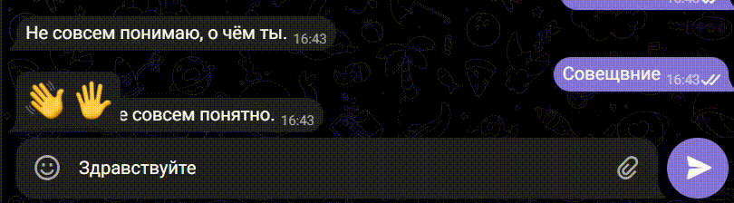

## Support-bot
Данный проект представляет собой систему ботов для автоматического ответа пользователям через Telegram или VK, с интеграцией через DialogFlow.
Боты принимают сообщения от пользователей, передают их в DialogFlow, получают обработанные ответы и отправляют пользователю.

Цель проекта -- ускорить ответ и автоматизировать обработку часто задаваемых вопросов.

### Технологии
- Python 3.11+
- DialogFlow API(Google Cloud)

### Установка и запуск проекта 
1. Склонируйте репозиторий
```bash
git clone http://github.com/pereskokovae/support-bot.git
```

2. Создайте и активируйте виртуальное окружение
Для Windows:
```bash
python -m venv venv
```
```bash
venv\Scripts\activate
```
Для Linux/macOS:
```bash
python3 -m venv venv
```
```bash
source venv/bin/activate
```

3. Установите зависимости
```bash
pip install -r requirements.txt
```

4. Настройте переменные окружения
Создайте файл `.env` в корне вашего проекта и вставьте туда ваши ключи и токены:
```bash
API_KEY_TG_BOT=токен_вашего_тг_бота
GOOGLE_APPLICATION_CREDENTIALS=путь_к_файлу_service_account.json
PROJECT_ID=идентификатор_вашего_dialogflow_проекта
API_KEY_VK_BOT=токен_вашего_вк_бота
```
- API_KEY_TG_BOT -- токен вашего Telegram бота, чтобы его получить, создайте бота в [@BotFather](https://telegram.me/BotFather).
- API_KEY_VK_BOT -- токен вашего VK бота, полученный в настройках группы во вкладке "Работа с API" --> "Создать ключ доступа".
- GOOGLE_APPLICATION_CREDENTIALS -- путь к json файлу сервисного аккаунта Google, который вы получили при настройку DialogFlow.
- PROJECT_ID -- идентификатор вашего проекта в Google Cloud, который вы получили при настройки DialogFlow.

### create_intent (helper_dialogflow.py)
- Содержит функции для общения с Dialogflow API.
- Позволяет создавать интенты (intents), с помощью кода.
- Обрабатывает и возвращает готовый текст ответа.

##### Как добавить новый интент
 1. Можно добавить интент вручную в консоли Dialogflow.
 2. Или создать интент программно через create_intent() в helper_dialogflow.py.
      - Вызовите функцию `create_intent(Ваш_проектный_ID)` в helper_dialogflow.py. Эта функция найдет файл `questions.json` в вашем проекте, извлечет оттуда данные и создаст новый интент в DialogFlow. Вы можете отредактировать файл под себя или воспользоваться тем, который уже есть в проекте.

### Пример работы бота в Telegram:
